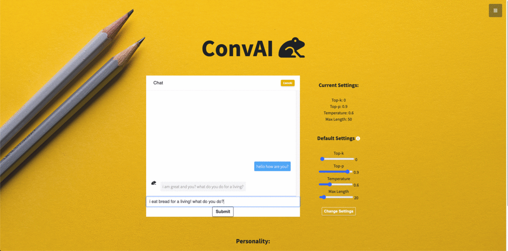

For preprocessing of data, two different training sources are used.
1) A counsel chat data based on online question and response by certified therapist is downloaded. The dataset and preprocessing script is adapted from https://github.com/nbertagnolli/counsel-chat To convert the counsel data into convai model format use the following command
python -m model_pipeline.counsel_data_preprocess --max_tokens 200 --n 3
where max_tokens are the max length of answer/response to be used and n is the number of randomly selected candidates to be trained against the given response. Output will be saved as json format in data file.

2) Movie script dialogues are downloaded as pdf and converted into convai data format. Movie scripts with good dialogues between limited parties are preferred.
Download the movie script you want in the same pdf format. Use the following command and change the pdf_file directory name
python -m model_pipeline.movie_data_preprocess --pdf_file './data/before-sunrise.pdf' --sel_chars_1 CELINE JESSE --max_tokens 100 --n 3 --test_size 0.2
sel_char_1 is the characters you want in the training data, where the first character 'CELINE' will be trained as the bot response. The other characters will be
the query party. Max_tokens are the max length of answer/response to be used, n is the number of randomly selected candidates to be trained against the given response
and test_size is the portion of dataset to be used for validation. Output will be saved as json format in data file.

For training, a grid search through language model coefficient, learning rate and number of candidate is used to seek the model with lowest evaluation language model loss.
For more understanding of the parameters being searched, refer to https://simpletransformers.ai/docs/convAI-model/.
Use the follow command to run the training for your selected train and evaluation data set, select cuda usage and n_epochs to train for each grid search.
python -m model_pipeline.model_train --train_file "data/counsel_before_sun_train.json" --eval_file "data/counsel_before_sun_val.json" --use_cuda 0 --n_epochs 10
